# Team Members:
- Durga Venkata Vamsi Akula - 0993203
- Dinesh Kumar Pendyala - 0999419

# Project Title: Toxic Comment Classification Challenge
## Motivation:
Discussing things you care about can be difficult especially online. The threat of abuse and harassment online means that many people stop expressing themselves and give up on seeking different opinions. In an effort to improve online conversation, one area of focus is the study of negative online behaviors, like toxic comments.

The main aim of this project is to identify and classify toxic online comments. We intend to build a model that’s capable of detecting different types of toxicity like threats, obscenity, insults, and identity-based hate etc.

Reference: https://www.kaggle.com/c/jigsaw-toxic-comment-classification-challenge

# About Dataset
- The dataset is downloaded directly from Kaggle website. According to Kaggle website, this dataset is a direct excerpt from **Wikipedia's talk page edits**. Through this project, we will hopefully help online discussion become more productive and respectful.
- There are 8 columns and **159571** records in training data. Out of 8 columns, 2 columns are simply **ID**, and the **comment_text** itself. The other 6 columns are **toxic**, **severe_toxic**, **obscene**, **threat**, **insult**, **identity_hate** which are traget classes.
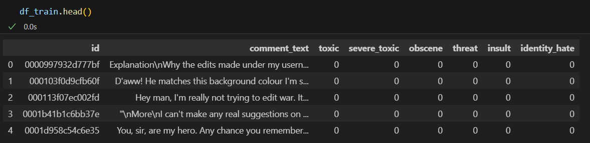
- There are two csv files pertaining to test data. In total, there are **153164** records in test data. Out of these, ground truth for only **63978** test records are provided as these records are used for scoring in the competiton. Hence, we use only these records as test data.
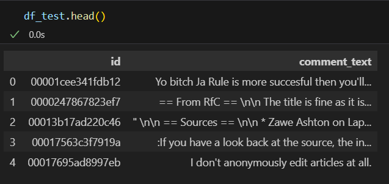
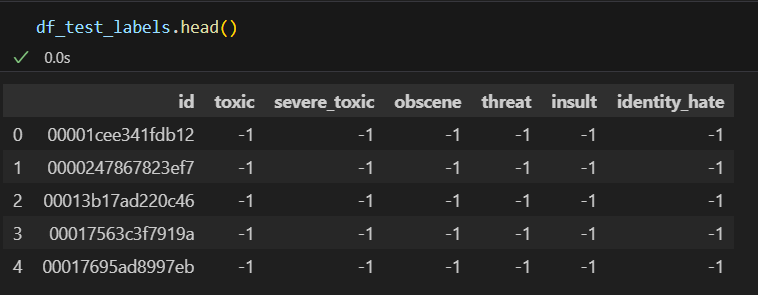
- Upon merging test.csv and test_labels.csv and filtering out samples without ground truth, we now have test data formatted just like our train data.
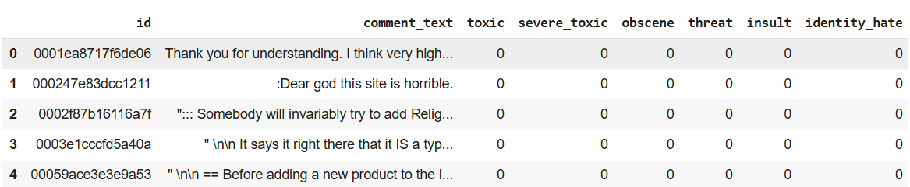

# Process Overview
For each sample in the test set, we must predict a probability for each of the six possible types of comment toxicity. To do so, we started with simple Logistic Regression first with binary countVectorizer and then with tfidf vectorizer. Later, tried Naive Bayes with countVectorizer and then with tfidf vectorizer. To improve on the performance, we then in-corporated models based on Recurrent Neural Networks and GRU. ROC_AUC_score is used as main metric in the Kaggle competition. Hence we used ROC_AUC_score in addition to F1_score as our metric to leverage each model's performance. 

# Exploratory Data Analysis(EDA)
```df_train.info()```           ```df_train.isnull().sum()```

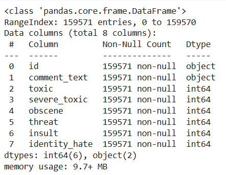         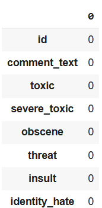


```
class_wise_count = df_train.iloc[:, 2:].sum()
plt.figure(figsize=(8, 5))
plt.title('Class wise count of labels')
barplot = sns.barplot(x=df_train.columns[2:], y=class_wise_count)
for i, value in enumerate(class_wise_count):
  barplot.text(i, value + 0.5, f'{value:.0f}', ha='center', va='bottom', fontsize=10)
plt.xlabel('Class Name')
plt.ylabel('Count')
plt.show()'
```
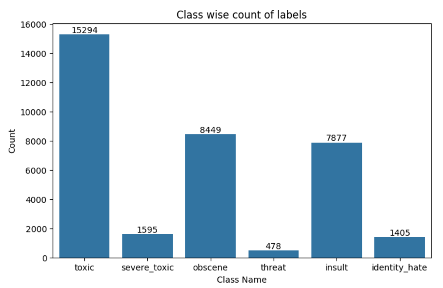

```
no_label_count = 0
records_noLabels = df_train.iloc[:, 2:].sum(axis = 1)
plt.figure(figsize=(8, 5))
plt.title('Labels per comment')
barplot = sns.countplot(x=records_noLabels.values)

plt.xlabel('Number of Labels')
plt.ylabel('Number of comments')
plt.show()
```
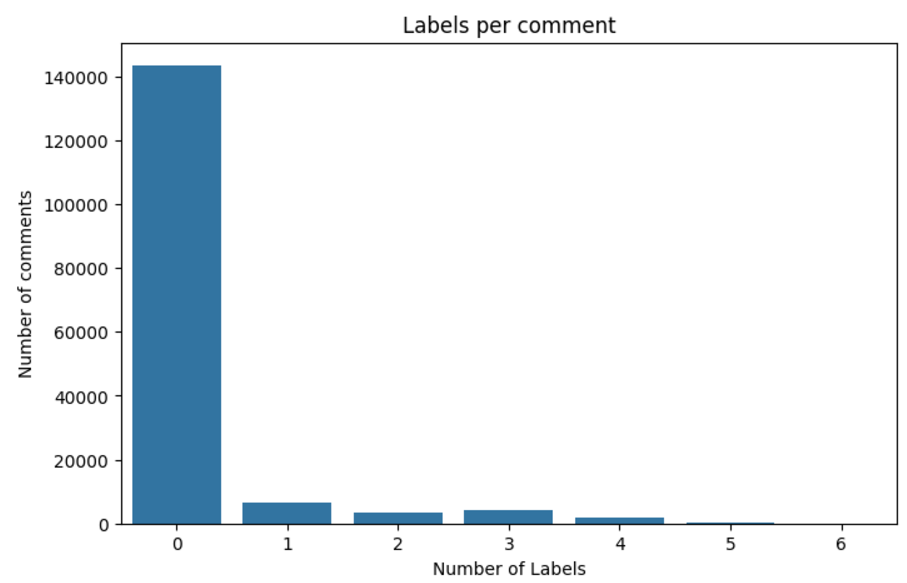
## Inference from data Exploration:
*   There are **159571** train samples. The data consists of 8 columns id, comment_text and 6 target classes namely 'toxic', 'severe_toxic', 'obscene', 'threat', 'insult', 'identity_hate'
*   After removing the test samples whose ground truth is not provided, we now have **63978** test samples.
*   There are no NULL values in the training data.
*   89% of comments are positive which mean all target classes have values 0.
*   In the remaining negative data, most comments are Toxic followed by Obscene and Insult.
*   This confirms the fact that the dataset is quite unbalanced.

# Data Preprocessing
Text data always requires rigorous cleaning and should be formatted to fit our model's input requirements. Doing these steps would reduce the processing time considerably.

## Data Cleaning:
The data cleaning here is a three fold process

1. Removing special characters and links from comment text.
```
def remove_special_characters(text_):
  text = re.sub(r'http\S+', ' ', text_ ) # to remove links
  text = re.sub(r'[^\w\s]', ' ', text) # to remove punctuation, spaces, tabs and line breaks
  text = re.sub(r'\bhttps?://[a-zA-Z0-9-]+(?:\.[a-zA-Z0-9-]+)+\b', ' ', text) # to remove links
  text = re.sub(r'\s+', ' ', text).strip() # to remove extra spaces at the start, middle and end
  text = re.sub(r'\d', ' ', text)  # Removes numbers be it any number of digits
  text = re.sub(r'\n', ' ', text)
  text= re.sub(r'[\u4e00-\u9fff]+', ' ', text) # to remove chinese
  return text
```
2. Tokenizing and Lemmatizing comment text.
```
def clean_comments(text):
    #tokenizing with words whose length >2
    tokenized_text = nltk.regexp_tokenize(text.lower(), r'(\b[\w]{2,}\b)')
    #lemmatizing each word
    lemmatizer = WordNetLemmatizer()
    cleaned_text = " ".join([lemmatizer.lemmatize(w) for w in tokenized_text])
    return cleaned_text.lower().strip()
```
3. Removing stopwords.
```
def remove_stopwords(text):
  words = word_tokenize(text)
  stop_words = set(stopwords.words('english'))
  filtered_sentence = [word for word in words if word.lower() not in stop_words]
  return " ".join(filtered_sentence)
```

## Handling Data Imbalances
Irrespective of what model we incorporate, it is must to handle class imbalances. Models trained on imbalanced datasets tend to have high accuarcy owing to model leaning towards majority class which results in lower precision and recall.
1. **For Naive Bayes model:**
- Naive Bayes classifiers are inherently not very sensitive to class imbalance, especially in multinomial and Bernoulli Naive Bayes, because they rely on probabilities derived from the data. Hence we decided not to incorporate any undersampling or oversampling techniques to handle imbalance.
- We did try to incorpoarte smote on train data. But Imbalanced-learn module currently supports only binary, multiclass and binarized encoded multiclasss targets. Multilabel and multioutput targets are not supported.
2. **For Logistic Regression model**
- The ```class_weight="balanced"``` parameter in the Logistic Regression model plays a crucial role when dealing with imbalanced datasets. This parameter automatically adjusts the weights of classes inversely proportional to their frequencies in the dataset.
The weight for each class is calculated as,

    ```weight for class c = total samples/(number of classes *samples in class c)```
- Improves the model's ability to correctly classify samples from minority classes and reduces bias towards majority classes.
3. **For RNN based model**
- To compute a single weight per sample, we need to aggregate the class weights for each sample. The simplest way to do this is to take the max, sum, or average of the class weights assigned to the positive classes for each sample. Here, we considered sum of class weights to compute class weight for each sample.
    ```
    class_weights = {}
    for i in range(num_classes):
        weights = compute_class_weight('balanced', classes=np.array([0, 1]), y=y_train[:, i])
        class_weights[i] = weights[1]  # Weight for the positive class

    # Combine class weights into a single sample weight
    def compute_sample_weight(y_train):
        # Initialize sample weights as zeros
        sample_weights = np.zeros(y_train.shape[0], dtype=float)

        # Iterate through each sample
        for i in range(y_train.shape[0]):
            # Aggregate class weights for the sample's positive classes (e.g., sum, max, or mean)
            positive_weights = [class_weights[j] for j in range(num_classes) if y_train[i, j] == 1]
            sample_weights[i] = sum(positive_weights) if positive_weights else 1.0  # Default weight for no positive classes

        return sample_weights
    sample_weights = compute_sample_weight(y_train)
    ```


# Model Fitting
## Splitting data
### For Linear Regression and Naive Bayes based models
- X and y are simply the comment text and 6 target classes respectively.
- Luckily, the train and test data is provided separately. So, we need not make the splits.
- We later use vectorizers to convert text to vectors in the pipelines.

### For RNN and GRU based models
- **Selecting vocabulary size:**
Most NLP datasets follow a Zipf’s law distribution, where a small number of words account for most of the occurrences. Most words in vocabulary are individual to their comments like proper nouns etc which occurs just once or twice. So, to save processing time, we decided to take words that covers 85% of data.
    ```
    Total vocabulary size: 157101
    Number of words covering 85% of data: 5077
    ```

- **Selecting maximum padding length for each sequence:** It is important to maintain uniform length of sequences while incorporating RNN and GRU based models. Hence to decide the optimum length of sequences, we took  maxlen as the 95th percentile of sequence lengths to avoid excessive padding.

- **Splitting:** Now split the training data into train and validation sets.
    ```
    X_train, X_val, y_train, y_val = train_test_split(X, y, test_size=0.2, random_state=42)
    ```
## Models trained
### Binary Relevance approach using oneVrest classifier
OneVsRestClassifier is a strategy for multiclass classification that involves training one classifier per class. For each classifier, the class is treated as the positive class, and all other classes are treated as the negative class.
- #### With Naive Bayes as Base Classifier:
    1. Using Binary CountVectorizer:
        ```
        MNB_pipeline_bin = Pipeline([
        ('tfidf', CountVectorizer(binary = True)),
        ('nb_model', OneVsRestClassifier(MultinomialNB(), n_jobs=-1))])
        ```
    2. Using tfidf vectorizer:
        ```
        MNB_pipeline_tfidf = Pipeline([
        ('tfidf', TfidfVectorizer(stop_words='english')),
        ('nb_model', OneVsRestClassifier(MultinomialNB(), n_jobs=-1))])
        ```

- #### With Logistic Regression as Base Classifier:
    1. Using CountVectorizer:
        ```
        LR_pipeline_bin = Pipeline([
        ('tfidf', CountVectorizer(binary = True)),
        ('lr_model', OneVsRestClassifier(LogisticRegression(class_weight="balanced"), n_jobs=-1))])
        ```
    2. Using tfidf vectorizer:
        ```
        LR_pipeline_tfidf = Pipeline([
        ('tfidf', TfidfVectorizer(stop_words='english')),
        ('lr_model', OneVsRestClassifier(LogisticRegression(class_weight="balanced"), n_jobs=-1))])
        ```
### RNN based model
This model consists of 4 layers namely Embedding layer, RNN layer, Dropout layer and output dense layer. This model is compiled with Adam optimiser and used binary_crossentropy as loss function.

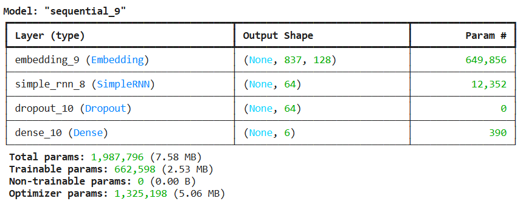

# Validation/Metrics
Accuracy is the go-to metric when it comes to classification problems. But not in the case of unbalanced datasets. Accuracy for unbalanced datasets is usually high as the model learns more about the majority class ignoring the case of minority class. These models also have poor precision and accuracy scores.

Metrics like **ROC_AUC score** and **precision recall curve** comes in handy when it comes to leveraging performance of models whose datsets are unbalanced. Hence we decided to use ROC_AUC scores of models to compare it's performance.
## Classification Reports
- **For Naive Bayes model with Binary count vectorizer**:

    For this model, we can observe that the roc_auc score is better and has a good accuracy. But this model fails to predict threat class correctly.same goes for classes - severe_toxic and identity_hate.

    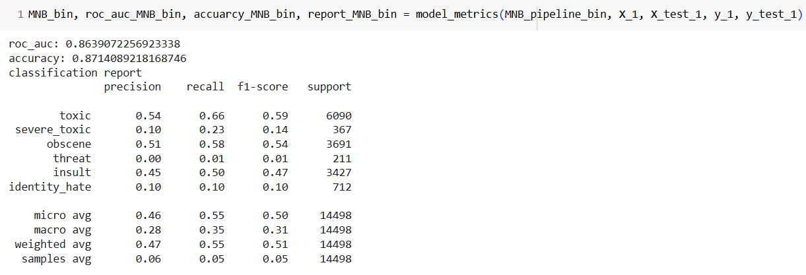
- **For Naive Bayes model with Tf-Idf count vectorizer:**

    This model has zero F1-score for classes - severe_toxic, threat and identity_hate. But we can observe it has higher accuarcy than previous model. This behaviour can be attributed to the dataset being imbalanced. 

    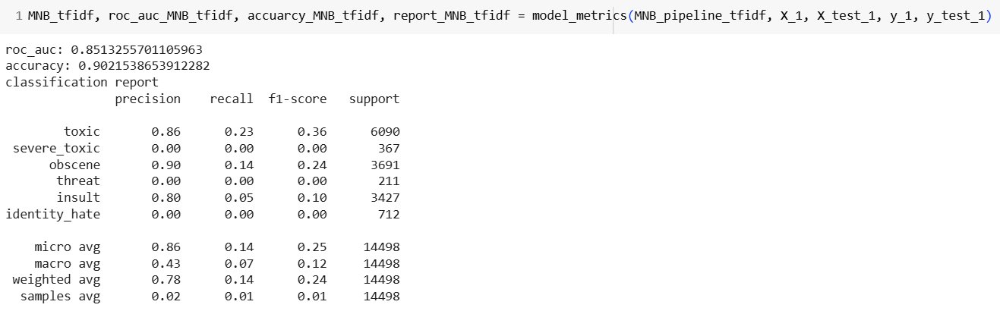
- **For Logistic Regression model with Binary count vectorizer:**

    Logistic Regression model outperforms the previous two models in ROC_AUC score. It also makes good prediction on classes the two models before failed to predict.
    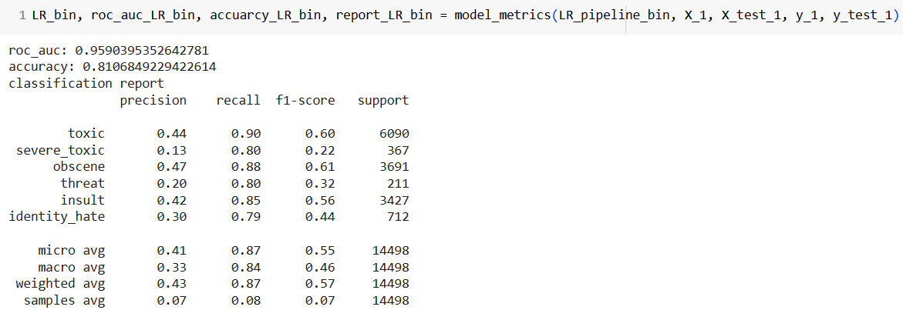
- **For Logistic Regression model with Tf-Idf vectorizer:**

    Of all four models trained so far, this model works the best. It has near perfect ROC_AUC score, takes all classes into consideration and has better accuracy.

    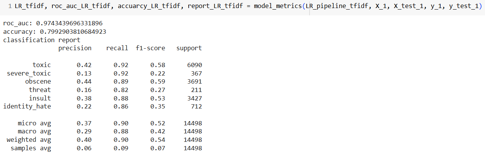
- **For RNN model**

    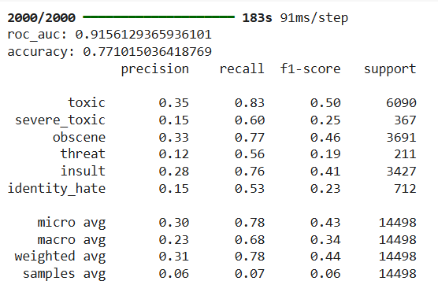
## ROC scores comparison
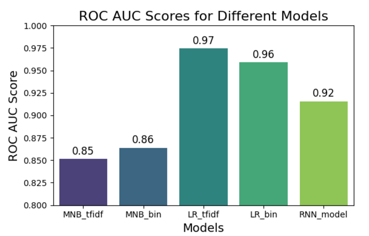

## Classwise metrics comparison for each model
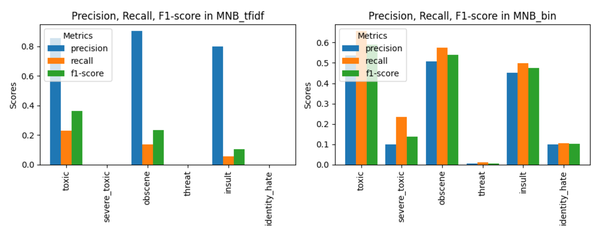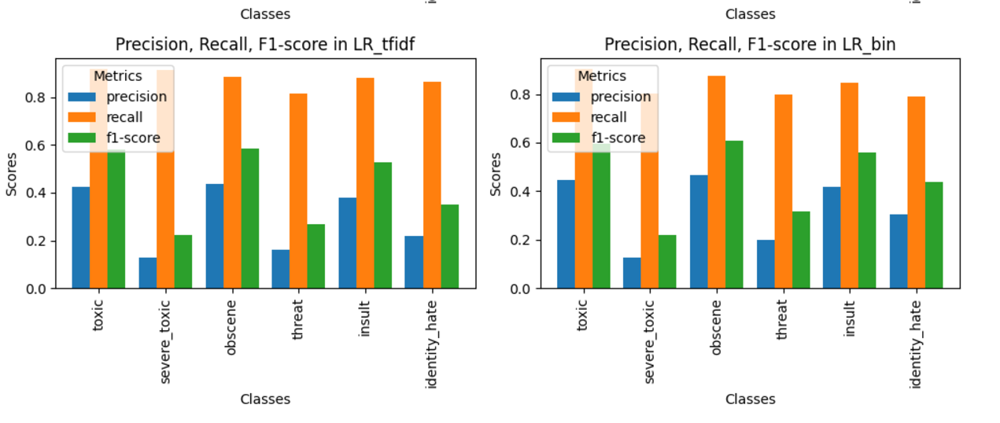

## ROC curve plots for each model
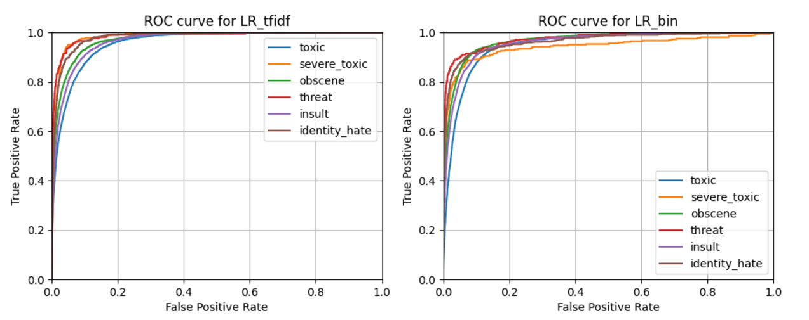
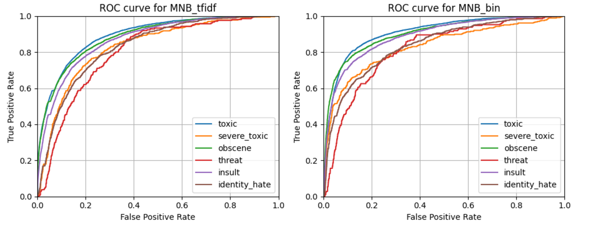

# Improvements and Going Furthur
- Better data gives better results. These models could work much better if we have more minority class data.
- We can improve on the RNN model incorporated using more layers and rigorous hyper parameter tuning. We can also use transformer based models like encoders for classification tasks.


